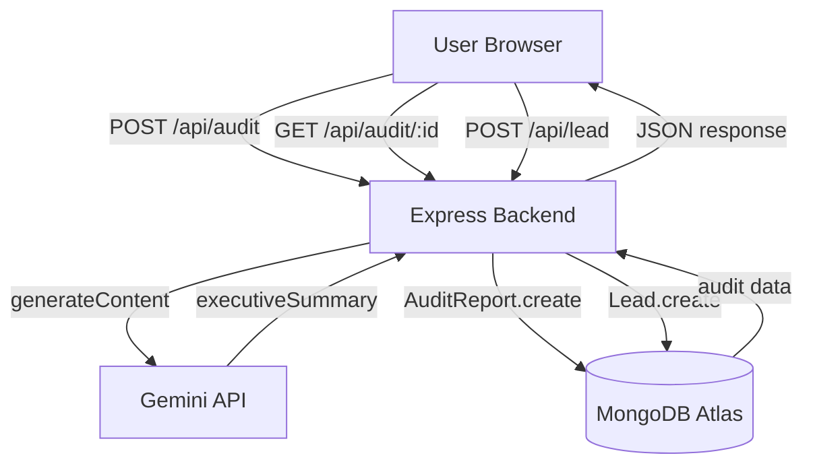

# ARCHITECTURE.md

## System Diagram

## Data Flow: Input → Audit Result

1. **User fills form** — tool name, plan, seats, monthly cost, team size, use case. Form state is persisted to `localStorage` on every change so no data is lost on reload.

2. **Frontend runs deterministic pre-calculation** — `calculateAuditDeterministic()` runs locally before the API call. This means the user sees results even if the backend is slow or the Gemini API fails.

3. **POST /api/audit** — Frontend sends the full tool payload plus the pre-calculated redundancies and alternatives to the backend.

4. **Backend calls Gemini API** — Passes tool data, spend, team size, and use case into a structured prompt. Receives a ~100-word executive summary paragraph.

5. **Backend saves to MongoDB** — AuditReport document created with a unique `_id` that becomes the shareable URL parameter.

6. **Response to frontend** — `auditId`, `optimizedTotal`, `executiveSummary`, `redundancies`, `aiAlternatives` returned. Frontend pushes `?auditId=...` to the URL.

7. **Share link** — Anyone opening `?auditId=xxx` hits `GET /api/audit/:id` which returns the report with identifying fields stripped.

## Stack Justification

| Layer | Choice | Why |
|---|---|---|
| Frontend | Vanilla JS + HTML/CSS | No build step, instant deploy, form-based UI doesn't need component reactivity |
| Backend | Node.js + Express | Lightweight, fast to iterate, same language as frontend reduces context switching |
| Database | MongoDB Atlas | Document model fits variable-length tool arrays; free tier sufficient for this scale |
| LLM | Gemini 2.5 Flash | Free tier, no credit card, fast inference, graceful fallback if unavailable |
| Deploy | Vercel (FE) + Render (BE) | Both have free tiers, auto-deploy from GitHub, HTTPS out of the box |

## Scaling to 10k Audits/Day

Current architecture would break at scale in these ways, and here's what I'd change:

**Database:** Add indexes on `createdAt` and `auditId`. At 10k/day (300k/month) MongoDB Atlas M10 cluster ($57/mo) handles this comfortably. Consider TTL index to expire old audits after 90 days.

**LLM calls:** Gemini free tier rate limits at ~60 RPM. At 10k/day that's ~7 RPM average but with traffic spikes we'd need a paid tier or a queue (BullMQ + Redis) to smooth burst traffic. Could also cache summaries for identical tool combinations.

**Backend:** Single Express instance on Render free tier sleeps after inactivity. For 10k/day: upgrade to paid Render instance, or migrate to Cloudflare Workers for edge execution with zero cold starts.

**Frontend:** Already static — Vercel CDN handles any traffic volume without changes.

**Rate limiting:** Current `express-rate-limit` is in-memory (resets on restart). Replace with Redis-backed rate limiter (`rate-limit-redis`) for multi-instance deployments.